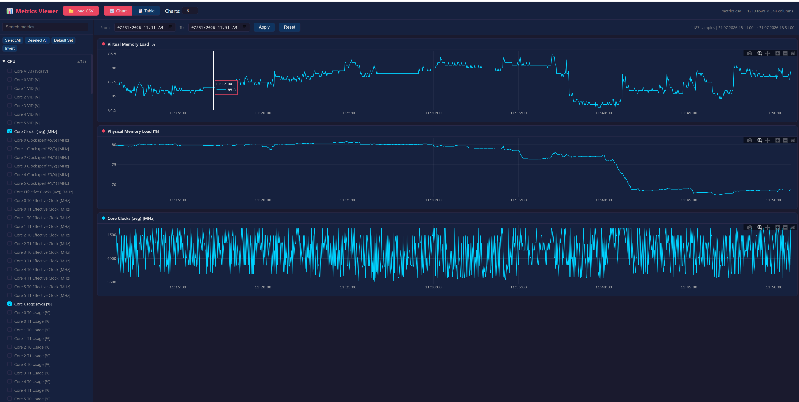

# HWiNFO64 Metrics Viewer

Interactive web app for viewing, filtering, and charting **HWiNFO64** CSV log files.

HWiNFO64 is a popular hardware monitoring tool that can log system sensors (CPU/GPU temps, clock speeds, voltages, memory, power, fan speeds, etc.) to CSV. This viewer makes it easy to explore those logs without opening Excel or writing scripts.

## Quick Start

```bash
npm install
npm start
```

Then open **http://localhost:3000** in your browser. The app auto-loads any `.csv` file found in the project root.



## How It Works

1. Place your HWiNFO64 CSV log (named `metrics.csv` or any `.csv`) in the project root
2. Start the server — the app discovers and loads the file automatically
3. Select metrics from the sidebar to chart them
4. Zoom, filter, and explore

## Features

- **Auto-detects CSV columns** — no configuration needed; works with any HWiNFO64 sensor set
- **Interactive charts** — powered by Plotly, with zoom, pan, and hover tooltips
- **Time range filtering** — zoom into specific windows using the From/To controls
- **Category grouping** — metrics are auto-grouped into CPU, GPU, Memory, Temperature, Voltage, Power, Fan, etc.
- **Toggle metrics on/off** — check/uncheck any metric in the sidebar
- **Highlight metrics** — shift-click a metric to highlight it across all charts
- **Table view** — switch to a scrollable data table with keyboard shortcut `T`
- **Search** — filter the metric list by name
- **Multiple CSV support** — if several `.csv` files exist, a dropdown lets you switch between them

## Supported CSV Format

Any HWiNFO64 CSV log with `Date` and `Time` columns as the first two fields. The date format `DD.M.YYYY` is handled automatically.

## Keyboard Shortcuts

| Key | Action |
|-----|--------|
| `T` | Toggle between Chart and Table view |
| `R` | Reset time range to full span |

## Stack

- **Backend:** Node.js + Express
- **Frontend:** Vanilla JS + Plotly.js + PapaParse
